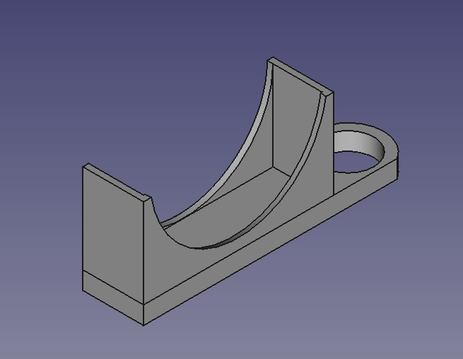

# PCB Scanner

This is a proof of concept: use an Anet A8 3D printer to scan
a PCB and create a very big image.

## Getting started

The main script is ``anet_scan.py``:

```
$ pip install pygame pyserial
$ python anet_scan.py <serial device path> <width in mm> <height in mm>
 ...
```

I advice to move manually the printer's head and position it so that the microscope
is at the lower left. The scan is done one columns at times, from the left to the right.

the resulting images are in the ``shoots/`` directory.

## Microscope holder

There is a ``FreeCAD`` design file named ``microscope_holder.fcstd`` for the microscope
holder.



The microscope used is [this](https://www.aliexpress.com/item/High-Quality-2-0-MP-HD-Android-phones-500X-USB-digital-microscope-electron-microscope-enlarge-for/32697275807.html)
but anyone would work as well.

## Stitching images

This is the hardest part: you could use [Hugin](http://hugin.sourceforge.net/) or [Imagej](ImageJ.net)
but with such large number of images it's unreliable; probably in future I will
create a script to mount them setting manually the offset between images.
